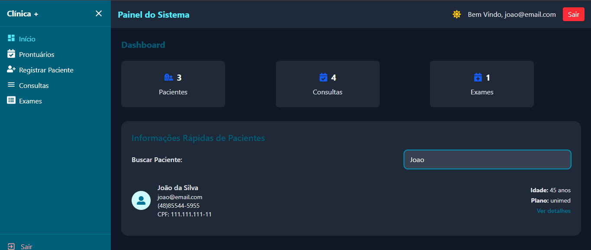
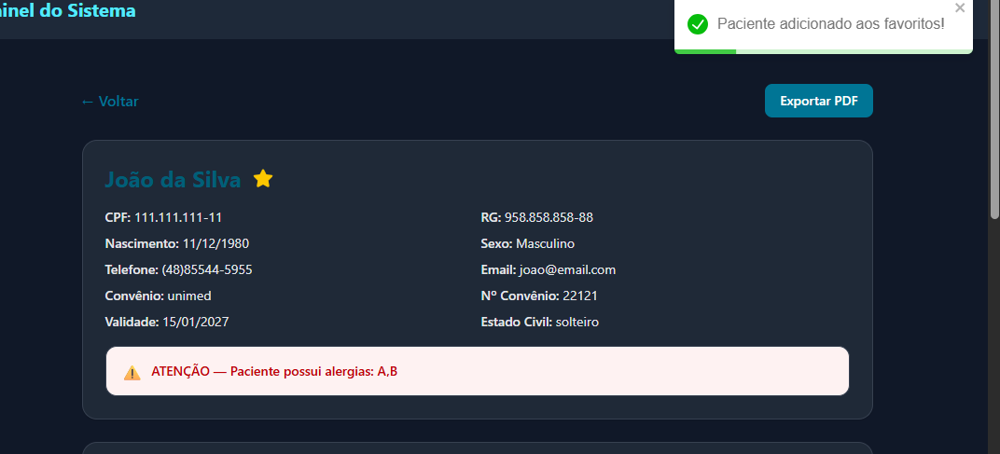
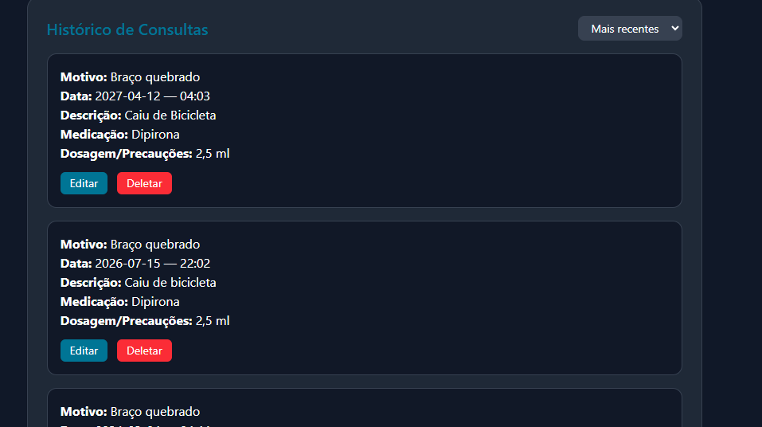
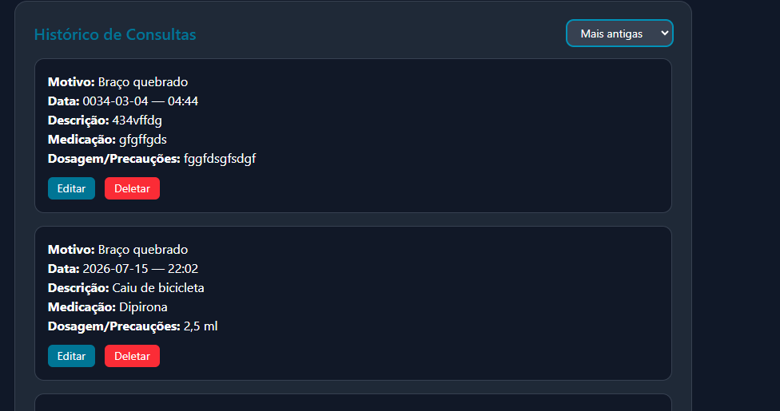

# Relatório de Atividade — Desenvolvimento de Features
**Projeto:** Clínica Saúde (Sistema de Gerenciamento de Pacientes)  
**Aluno:** Isaque Ribeiro  
**Curso:** Técnico de Desenvolvimento de Sistemas — Terceira Fase  
**Data:** 06/07/2026  

---

## Ferramentas Utilizadas

| Ferramenta | Finalidade |
|---|---|
| React 19 + Vite 8 | Framework frontend |
| Tailwind CSS v4 | Estilização |
| Axios | Requisições HTTP ao backend |
| jsPDF | Geração de PDF do prontuário |
| react-icons | Ícones (FaStar, FaRegStar, FaMoon, FaSun) |
| json-server v1 beta | Backend fake |
| localStorage | Persistência de tema e favoritos no navegador |
| Claude (IA) | Apoio no desenvolvimento |

---

## Feature 1 — Busca Avançada de Pacientes

### Descrição
A busca de pacientes foi ampliada para pesquisar por múltiplos campos simultaneamente.
O campo de busca único filtra em tempo real por:

- Nome completo
- Email
- CPF
- Telefone
- Convênio

A busca funciona tanto no `PatientsList` (dashboard) quanto no `MedicalRecordList` (prontuários).

### Principais pontos do código

A lógica usa `Array.filter()` com múltiplas condições encadeadas pelo operador `||`:

```js
const filteredPatients = patients.filter((patient) => {
    const search = searchTerm.toLowerCase().trim();

    if (!search) return true; // se vazio, mostra todos

    return (
        patient.fullName?.toLowerCase().includes(search) ||
        patient.email?.toLowerCase().includes(search) ||
        patient.phone?.toLowerCase().includes(search) ||
        patient.cpf?.toLowerCase().includes(search) ||
        patient.healthInsurance?.toLowerCase().includes(search)
    );
});
```

O operador `?.` (optional chaining) é usado para evitar erros quando algum campo
está vazio ou indefinido no banco — se `patient.cpf` for `undefined`,
`patient.cpf?.toLowerCase()` retorna `undefined` em vez de lançar um erro.

### Print da feature funcionando



> *Campo de busca com "Joao" digitado — apenas o João da Silva aparece na lista,
> filtrando os outros pacientes em tempo real.*

---

## Feature 2 — Dark Mode

### Descrição
Foi implementado um modo escuro completo no sistema, acessível pelo botão de
lua/sol no cabeçalho. O tema escolhido é salvo no `localStorage` do navegador,
então permanece mesmo após fechar e reabrir o sistema.

### Onde foi implementado
O Dark Mode foi implementado exclusivamente no `DashboardLayout.jsx`,
que envolve todas as páginas via `<Outlet />`. Isso significa que **não foi necessário
alterar nenhum componente individualmente** — o tema se aplica globalmente.

### Principais pontos do código

**Estado e persistência no `DashboardLayout`:**
```js
const [darkMode, setDarkMode] = useState(() => {
    return localStorage.getItem("theme") === "dark";
});

useEffect(() => {
    if (darkMode) {
        document.body.classList.add("dark");
    } else {
        document.body.classList.remove("dark");
    }
    localStorage.setItem("theme", darkMode ? "dark" : "light");
}, [darkMode]);
```

**CSS global no `index.css` que responde à classe `body.dark`:**
```css
.dark .bg-white {
    background-color: #1f2937 !important;
}
.dark .text-gray-800,
.dark .text-gray-700 {
    color: #e5e7eb !important;
}
.dark input, .dark select, .dark textarea {
    background: #374151;
    color: white;
}
```

A estratégia foi adicionar a classe `dark` no `<body>` via JavaScript,
e o CSS global se encarrega de sobrescrever as cores do Tailwind automaticamente
em todos os componentes — sem precisar tocar em cada um individualmente.

### Print da feature funcionando



> *Sistema completo em modo escuro — header, sidebar, cards e formulários
> todos adaptados automaticamente pela classe `body.dark`.*

---

## Feature 3 — Ordenação de Consultas e Exames por Data

### Descrição
Foi adicionado um `<select>` no histórico de consultas e no histórico de exames
da tela de detalhes do paciente (`PatientDetails`). O usuário pode alternar entre
**"Mais recentes primeiro"** e **"Mais antigas primeiro"** de forma independente
em cada lista.

### Problema identificado
O banco de dados (`db.json`) continha datas em dois formatos diferentes:
- `DD-MM-YYYY` — datas digitadas manualmente
- `YYYY-MM-DD` — datas vindas do `<input type="date">` do HTML

O JavaScript não interpreta corretamente o formato `DD-MM-YYYY` no construtor
`new Date()`, o que causaria ordenação incorreta silenciosamente.

### Solução implementada

Foi criada uma função `parseDate` interna que detecta o formato e normaliza
para ISO antes de comparar:

```js
const orderedConsults = [...consults].sort((a, b) => {
    const parseDate = (dateStr, timeStr) => {
        if (!dateStr) return new Date(0);
        let iso = dateStr;
        // se vier DD-MM-YYYY, converte para YYYY-MM-DD
        if (/^\d{2}-\d{2}-\d{4}$/.test(dateStr)) {
            const [d, m, y] = dateStr.split("-");
            iso = `${y}-${m}-${d}`;
        }
        return new Date(`${iso}T${timeStr || "00:00"}`);
    };
    const dateA = parseDate(a.date, a.time);
    const dateB = parseDate(b.date, b.time);
    return consultOrder === "recent" ? dateB - dateA : dateA - dateB;
});
```

`[...consults].sort()` cria uma cópia do array antes de ordenar — nunca
se deve mutar o array original do state, pois o React detecta mudanças
por referência e uma mutação direta impede re-renders corretos.

Também foi corrigido um problema com o json-server v1 beta: a filtragem
por `?patientId=` não funciona nessa versão. A solução foi buscar todos
os registros e filtrar no frontend:

```js
const consultsRes = await axios.get("http://localhost:3000/consults");
const filteredConsults = consultsRes.data.filter((c) => c.patientId === id);
```

### Prints da feature funcionando



> *Select em "Mais recentes" — consulta de 2027 aparece primeiro, depois 2026.*



> *Select em "Mais antigas" — a lista inverteu, consulta de 0034 aparece primeiro.*

---

## Feature Nova — Pacientes Favoritos

### Descrição
Feature criada como contribuição original, não constando na lista sugerida
pelo professor.

Uma estrela (⭐) aparece ao lado do nome do paciente na tela de detalhes.
Ao clicar, o paciente é marcado como favorito — a estrela fica amarela e preenchida.
Ao clicar novamente, o favorito é removido. Os favoritos são salvos no
`localStorage`, persistindo entre sessões.

### Justificativa
Em sistemas de saúde com muitos pacientes, médicos e recepcionistas frequentemente
precisam acessar rapidamente os mesmos pacientes (pacientes crônicos, em
acompanhamento contínuo, etc). O sistema de favoritos permite marcar esses
pacientes para acesso rápido futuro.

### Principais pontos do código

**Carregar favoritos ao abrir o prontuário:**
```js
useEffect(() => {
    const favorites =
        JSON.parse(localStorage.getItem("favoritePatients")) || [];
    setFavorite(favorites.includes(id));
}, [id]);
```

**Alternar favorito:**
```js
const toggleFavorite = () => {
    let favorites =
        JSON.parse(localStorage.getItem("favoritePatients")) || [];

    if (favorites.includes(id)) {
        favorites = favorites.filter((item) => item !== id);
        setFavorite(false);
        toast.info("Paciente removido dos favoritos.");
    } else {
        favorites.push(id);
        setFavorite(true);
        toast.success("Paciente adicionado aos favoritos!");
    }

    localStorage.setItem("favoritePatients", JSON.stringify(favorites));
};
```

**Botão visual com estrela:**
```jsx
<button onClick={toggleFavorite} className="text-yellow-400 hover:scale-110 transition-transform">
    {favorite ? <FaStar size={22} /> : <FaRegStar size={22} />}
</button>
```

`FaStar` é a estrela preenchida (favorito ativo) e `FaRegStar` é a estrela
vazia (sem favorito). O React alterna entre elas baseado no estado `favorite`.

### Print da feature funcionando


> *Estrela amarela ⭐ ao lado do nome "João da Silva" e toast verde
> "Paciente adicionado aos favoritos!" confirmando a ação.*

---

## Conclusão

As quatro features foram implementadas com sucesso no projeto Clínica Saúde,
respeitando a estrutura original do professor e sem criar novos componentes.

Durante o desenvolvimento foram identificados e resolvidos problemas reais:
- **Incompatibilidade do json-server v1 beta** com filtros por query param → resolvido filtrando no frontend
- **Formatos de data inconsistentes** no banco → resolvido com função `parseDate` que normaliza antes de comparar

### Resumo das features entregues

| # | Feature | Arquivo modificado |
|---|---|---|
| 1 | Busca avançada por nome, CPF, email, telefone e convênio | `PatientsList/index.jsx`, `MedicalRecordList/index.jsx` |
| 2 | Dark Mode com persistência no localStorage | `DashboardLayout.jsx`, `index.css` |
| 3 | Ordenação de consultas e exames por data | `PatientDetails/index.jsx` |
| Nova | Sistema de pacientes favoritos com localStorage | `PatientDetails/index.jsx` |
